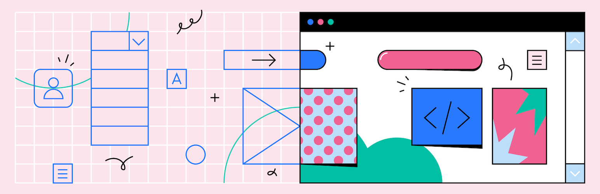

<!-- DO NOT EDIT THIS FILE; it is auto-generated from readme.txt -->
# Material Design for WordPress

The official Material Design plugin for WordPress. Customize your site’s navigation, colors, typography, and shapes, use Material Components, and choose from over 1,000 Google Fonts and Material Design icons. From the team behind Google’s open-source design system.

**Contributors:** [google](https://profiles.wordpress.org/google), [materialdesign](https://profiles.wordpress.org/materialdesign), [xwp](https://profiles.wordpress.org/xwp)
**Requires at least:** 5.6
**Tested up to:** 5.8.2
**Stable tag:** 0.7.0
**License:** [Apache License, Version 2.0](https://www.apache.org/licenses/LICENSE-2.0)

## Description ##

The official Material Design plugin for WordPress. Customize your site’s navigation, colors, typography, and shapes, use Material Components, and choose from over 1,000 Google Fonts and Material Design icons. From the team behind Google’s open-source design system.

It’s easy to get up and running with Material Design for WordPress:

## Installation ##

1. Upload the folder to the `/wp-content/plugins/` directory.
2. Activate the plugin through the 'Plugins' menu in WordPress.

## Frequently Asked Questions ##

Don’t see an answer to your question? Please search the support forum to see if it has already been discussed. Otherwise, please open a new support topic.

## Screenshots ##

### Start from our existing styles and use Material Theming to create a custom look and feel. (Baseline)

### Start from our existing styles and use Material Theming to create a custom look and feel. (Crane)

### Start from our existing styles and use Material Theming to create a custom look and feel. (Fortnightly)

### Start from our existing styles and use Material Theming to create a custom look and feel. (Blossom)

### Choose from more than 1,000 typefaces in Google Fonts to set your headline and body styles.

### Material Icons are included with this plugin. Choose from Filled, Sharp, Rounded, Outlined, or Two-Tone styles.

### Add Material Components like buttons and cards, and create layouts for things like image-heavy pages or styled contact forms.

### Choose colors, typography, shapes, and icons to express your unique style.

## Contributors ##

Material Design is a design system created by Google and backed by open-source code that helps teams build high-quality digital experiences.

- [Google](https://profiles.wordpress.org/google/)
- [Material Design](https://profiles.wordpress.org/materialdesign/)
- [XWP](https://profiles.wordpress.org/xwp/)

## Changelog ##

For the plugin’s changelog, please see [the Releases page on GitHub](https://github.com/material-components/material-design-for-wordpress/releases).
